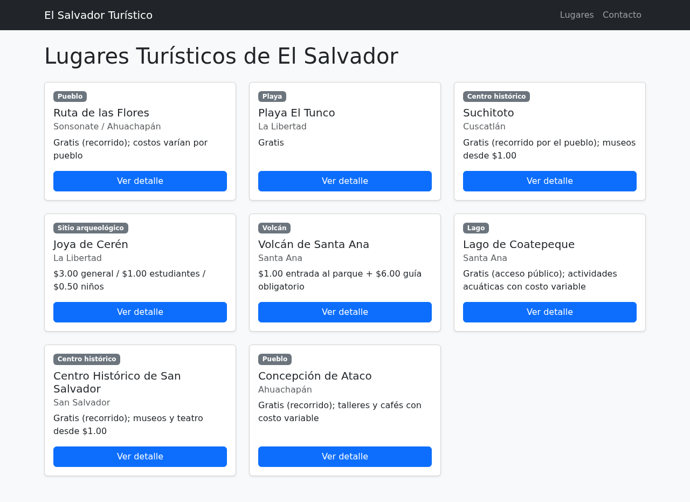
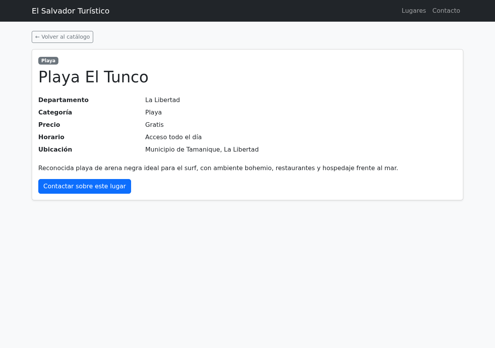
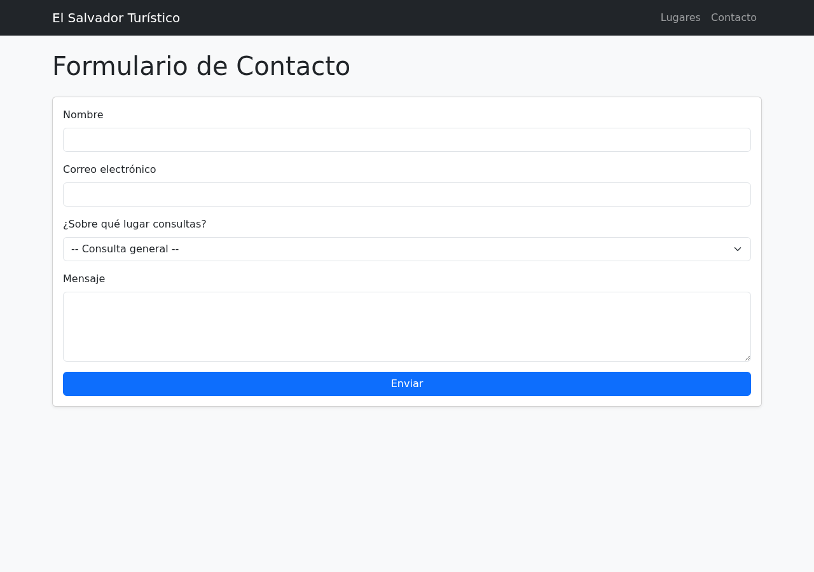
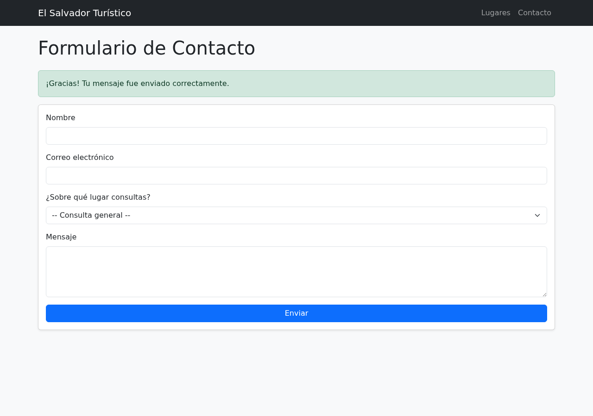

# Catálogo Turístico de El Salvador — Práctica de MVC en Laravel

Aplicación web desarrollada como ejercicio del bootcap fullstack jr de Kodigo para demostrar la implementación del patrón arquitectónico **MVC (Modelo-Vista-Controlador)** en Laravel. Permite explorar un catálogo de destinos turísticos de El Salvador, ver el detalle de cada lugar y enviar un formulario de contacto para solicitar más información.

La fuente de datos de los lugares turísticos es un **archivo JSON** (no una base de datos), con el objetivo de practicar el manejo de archivos y estructuras de datos en PHP dentro del flujo MVC.

## Requisitos

- PHP 8.2 o superior
- Composer

## Instalación

```bash
git clone git@github.com:InfinityJaaR/mvc-laravel.git
cd mvc-laravel

composer install

cp .env.example .env
php artisan key:generate

php artisan migrate

php artisan serve
```

La aplicación quedará disponible en `http://localhost:8000`. La migración configura las tablas por defecto de Laravel (sesiones, caché, colas en SQLite); **el catálogo de lugares turísticos no usa base de datos**, se sirve desde un archivo JSON (ver sección de datos de prueba).

## Flujo MVC implementado

La aplicación sigue el ciclo completo de una petición HTTP a través de las tres capas de MVC:

```
Ruta (routes/web.php)
    → Controlador (app/Http/Controllers/*.php)
        → Modelo (app/Models/Lugar.php)
            → Vista (resources/views/**/*.blade.php)
```

**Rutas** (`routes/web.php`) — definen los endpoints y a qué acción de controlador los envían:

| Método | URI              | Controlador@Acción            | Nombre           |
|--------|------------------|--------------------------------|------------------|
| GET    | `/`              | Redirect a `/lugares`          | —                |
| GET    | `/lugares`       | `LugarController@index`        | `lugares.index`  |
| GET    | `/lugares/{id}`  | `LugarController@show`         | `lugares.show`   |
| GET    | `/contacto`      | `ContactoController@create`    | `contacto.create`|
| POST   | `/contacto`      | `ContactoController@store`     | `contacto.store` |

**Controladores** (`app/Http/Controllers/`) — reciben la petición, piden los datos al modelo y eligen la vista a renderizar:
- `LugarController`: `index()` lista todos los lugares; `show($id)` muestra el detalle de uno o responde 404 si no existe.
- `ContactoController`: `create()` muestra el formulario (pre-seleccionando un lugar si se llega desde su detalle); `store()` valida los datos enviados, los agrega a `storage/app/private/contactos.json` y redirige con un mensaje de confirmación (patrón Post/Redirect/Get).

**Modelo** (`app/Models/Lugar.php`) — en vez de extender `Eloquent Model` (que trabajaría con base de datos), es una clase PHP plana que lee y decodifica `resources/data/lugares.json`, exponiendo `Lugar::all()` y `Lugar::find($id)`. Esto es intencional: el ejercicio busca practicar el manejo de archivos y estructuras de datos en PHP como fuente de un "modelo", no el ORM de Laravel.

**Vistas** (`resources/views/`) — plantillas Blade que reciben los datos del controlador y los renderizan, sin lógica de negocio:
- `layouts/app.blade.php` — layout compartido con navegación y Bootstrap.
- `lugares/index.blade.php` — catálogo en formato de tarjetas.
- `lugares/show.blade.php` — detalle de un lugar (título, departamento, categoría, precio, horario, ubicación, descripción).
- `contacto/create.blade.php` — formulario de contacto con validación y mensaje de éxito.

## Datos de prueba

`resources/data/lugares.json` contiene 8 lugares turísticos reales de El Salvador (Ruta de las Flores, Playa El Tunco, Suchitoto, Joya de Cerén, Volcán de Santa Ana, Lago de Coatepeque, Centro Histórico de San Salvador y Concepción de Ataco), cada uno con: `id`, `titulo`, `departamento`, `categoria`, `precio`, `descripcion`, `horario`, `ubicacion` e `imagen`.

Los mensajes enviados desde el formulario de contacto se acumulan en `storage/app/private/contactos.json` (archivo generado en tiempo de ejecución, excluido de git).

## Capturas de pantalla

**Catálogo de lugares turísticos**


**Detalle de un lugar**


**Formulario de contacto**


**Confirmación de envío**

